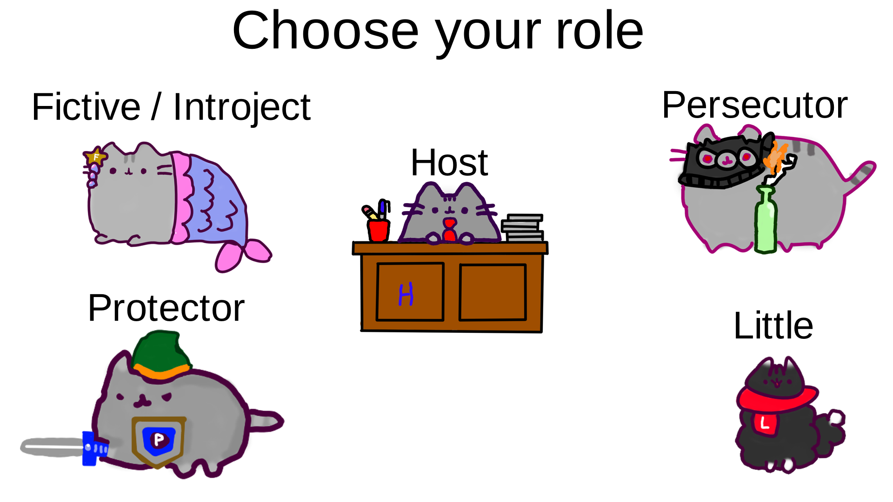

# Zeta sings the memes of her people

---

---

---

---

---

---

---

---

---

<!--
- The little
- The protector
- Introject / Fictive
- The persecutor
-->
---

---

### Medical system symptoms

> A. **Disruption of identity characterized** by two or more distinct
personality states, which may be described in some cultures
as an experience of possession. The disruption in identity
involves marked discontinuity in sense of self and sense of
agency, accompanied by related alterations in affect,
behavior, consciousness, memory, perception, cognition,
and/or sensory-motor functioning. These signs and
symptoms may be observed by others or reported by the
individual.
B. **Amnesia** Recurrent gaps in the recall of everyday events, important
personal information, and/or traumatic events that are
inconsistent with ordinary forgetting.
C. **Distress** The symptoms cause clinically significant distress or
impairment in social, occupational, or other important areas
of functioning.
D. The disturbance is not a normal part of a broadly accepted
cultural or religious practice.
Note: In children, the symptoms are not better explained by
imaginary playmates or other fantasy play.
...

*DSM 5-TR*

---

# Memes

---

---

### Dating

---

---

# Amnesia

---

---

---

<!-- Dissociation -->

---

---

# The spicy alter

---

---

---

# Littles

---

---

---

---

---

# Decision making

---

# Funnier as a System®

---

---

---

---
